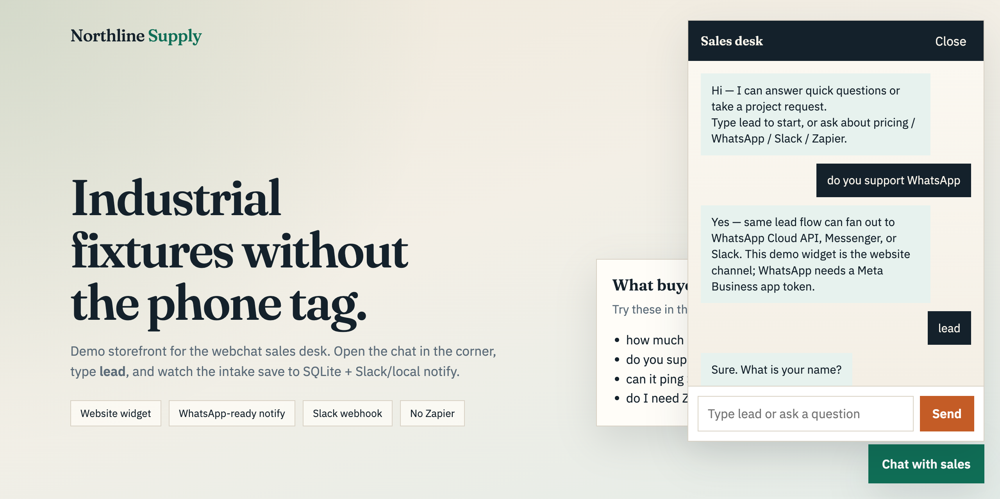
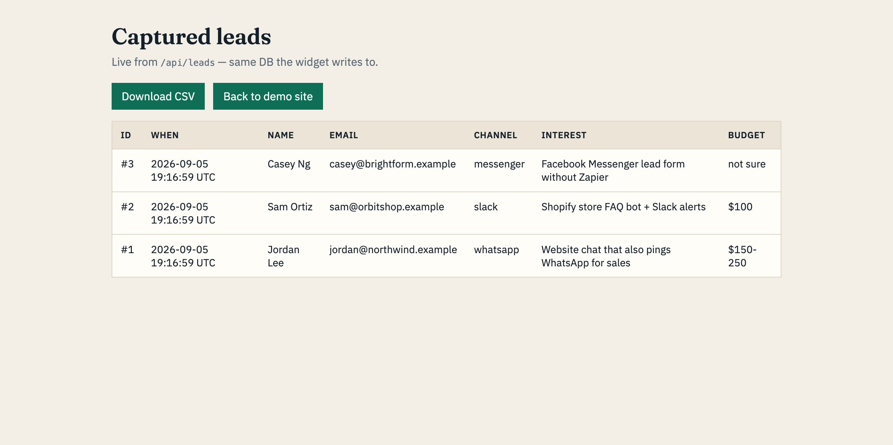
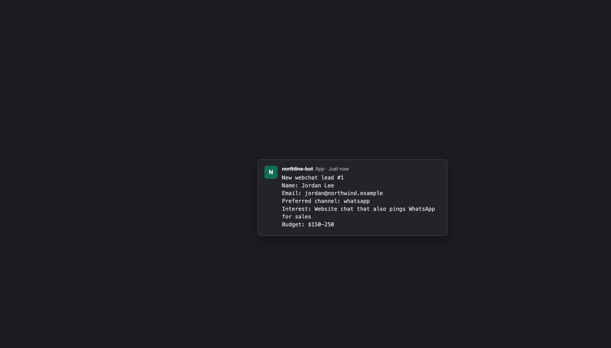

<div align="center">

# Webchat Sales Desk

**Drop-in website chat widget that answers FAQs, collects leads into SQLite, and pings the owner on Slack or WhatsApp.**


[](LICENSE)



</div>

## What it does

- **Floating widget** on any page — one `<script>` tag, vanilla JS, no framework.
- **Keyword FAQ** — pricing, WhatsApp, Slack, Zapier, Dialogflow. Swap the matcher for Dialogflow/Rasa without touching the widget.
- **Guided lead intake** — visitor types `lead`, bot asks name → email → channel → interest → budget, saves to SQLite.
- **Owner alerts** — Slack incoming webhook and/or WhatsApp Cloud API. With neither configured, alerts go to `data/notify_log.jsonl` so the demo still runs.
- **Leads UI + CSV export** — `/leads-ui` table, `GET /api/leads`, `POST /api/export`.

<div align="center">


</div>

## Run

```bash
git clone https://github.com/Kennurken/webchat-sales-desk && cd webchat-sales-desk
python3 -m venv .venv && source .venv/bin/activate
pip install -r requirements.txt
cp .env.example .env

uvicorn main:app --port 8790
```

Open http://127.0.0.1:8790 and click **Chat with sales**. `python demo_sim.py` seeds a few sample leads.

## Configure alerts

| `.env` variable | Effect |
|---|---|
| `SLACK_WEBHOOK_URL` | post a card to Slack on every new lead |
| `WHATSAPP_TOKEN`, `WHATSAPP_PHONE_NUMBER_ID` | send a WhatsApp message via Meta Cloud API |
| `NOTIFY_FALLBACK_PATH` | where alerts are logged when neither is set |
| `DATABASE_PATH` | SQLite file (default `data/leads.db`) |

## API

| Route | Purpose |
|---|---|
| `POST /api/chat` `{session_id, message}` | one turn of the conversation |
| `GET /api/leads` | last 30 leads as JSON |
| `POST /api/export` | download all leads as CSV |
| `GET /health` | liveness |

## Layout

```
main.py        FastAPI app, routes, static demo storefront
chat_flow.py   session state machine: welcome → FAQ or lead intake
faq.py         keyword → answer table
store.py       SQLite lead store + CSV export
notify.py      Slack / WhatsApp / local-log fan-out
static/        demo storefront + widget JS/CSS
```

## Limitations

- FAQ is keyword matching, not NLU.
- WhatsApp integration notifies the owner; it is not a two-way WhatsApp inbox.
- Messenger/Instagram follow the same Graph API pattern but are not wired.

## License

MIT © Eldos Kydyrbek
